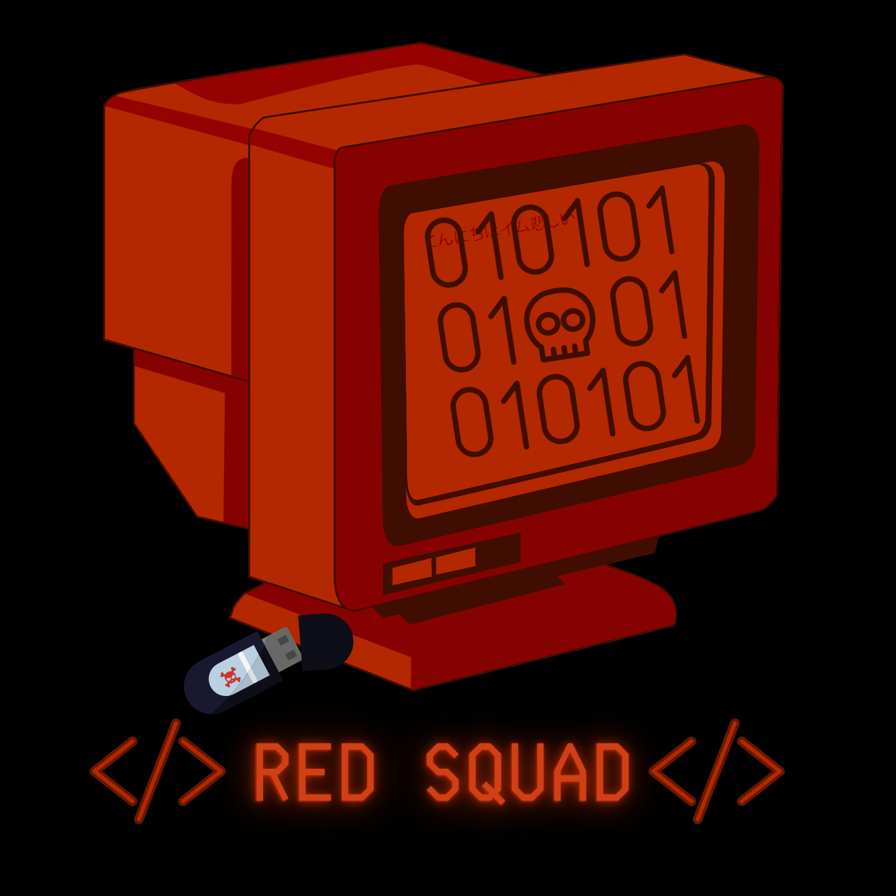

# ➡ /home/red-squad

<figure><figcaption></figcaption></figure>

## `whoami`


This gitbook is maintained by 2 young pentesters which is an inventory of everything we use in a daily basis and things learned about cybersecurity/pentesting/redteaming these past few years. We will try our best to update the gitbook alongside with new challanges that we meet.

You will find basic to advanced techniques/methods/informations that we encountered during our work and through various CTFs on tryhackme/hackthebox.

<mark style="color:red;">**⬆ Don't forget to support our projects and to BuyUsACoffee ⬆**</mark>&#x20;


<figure><figcaption>
Us
</figcaption></figure>
