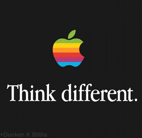

# 🍏 iOS

## Tools

### Jailbreak


_Jailbreaking iPhones and iPads are common among Apple users who want to install apps that aren't available through Apple's official channels._&#x20;

Apps are frequently posted on **Cydia** and other jailbroken device download sites by developers who don't want to go through Apple's review process or follow Apple's AppStore guidelines.&#x20;

Jailbreaking can also be used to get around **Digital Rights Management** (DRM) and share **copyrighted media** and gain access to **restricted file systems**, **user interfaces**, and **network capabilities**.

The terms “tethered” and “untethered” are sometimes used in relation to jailbreaking :

* **A tethered jailbreak** requires the iOS device to be plugged into a computer when turned on. If the iPhone is not plugged into a computer and booted with special software, the device will not enter a jailbroken state.
* **Untethered jailbreaks** do not require a computer. Everything required to enter the jailbroken state is contained on the iPhone. Rebooting away from a computer does not affect the jailbreak.&#x20;






### Bypass Detection





### SAST



### DAST






